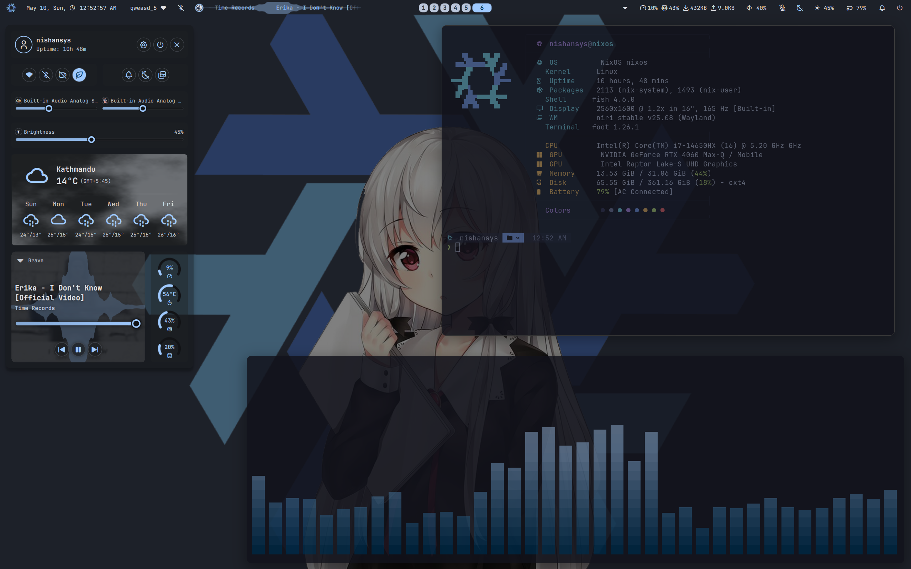
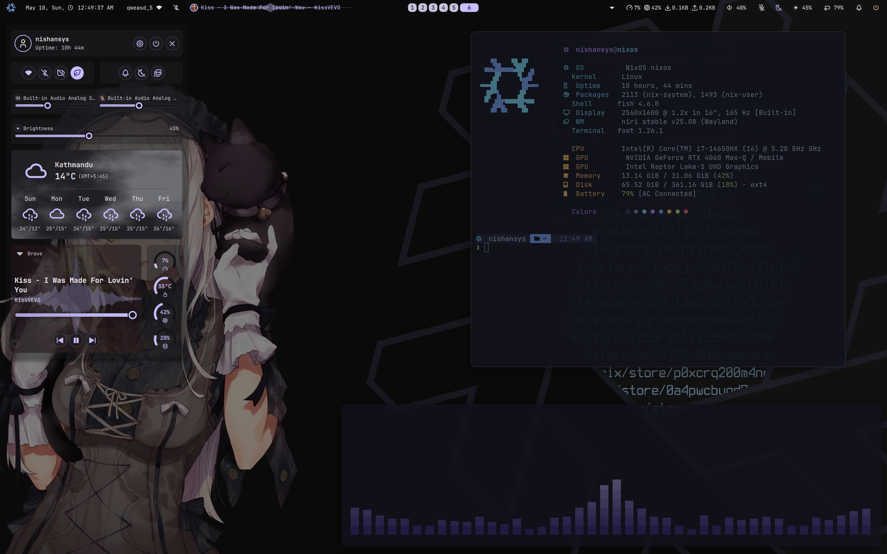
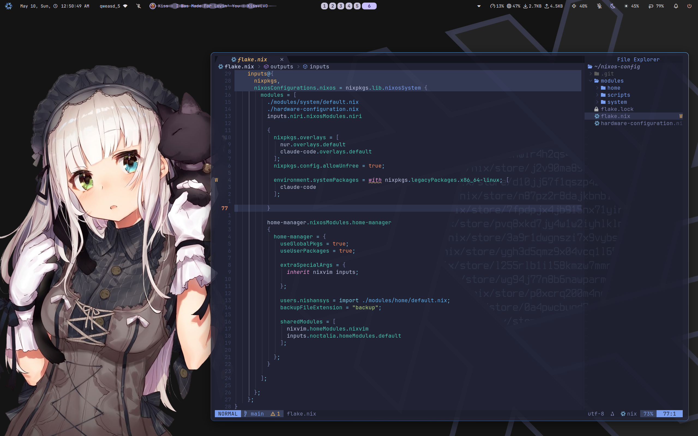
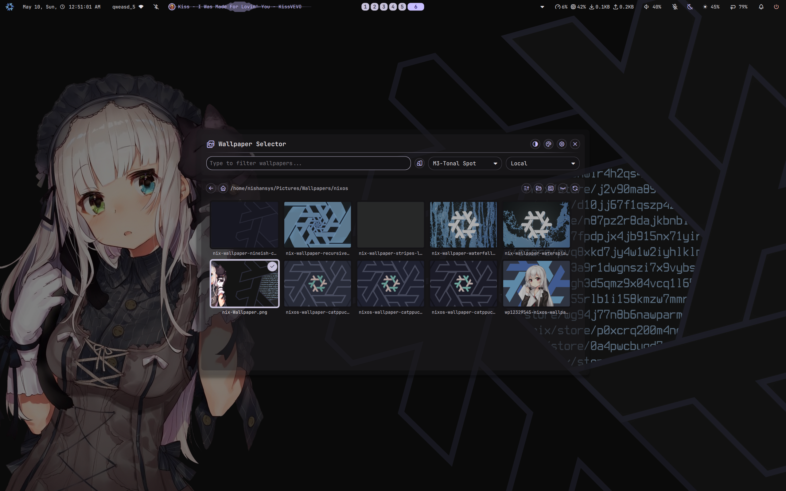

<div align="center">

# ❄ nixos-config

**A declarative NixOS setup — Niri compositor + Noctalia shell, fully reproducible.**

[](https://nixos.org)
[](https://github.com/YaLTeR/niri)
[](https://github.com/noctalia-dev/noctalia)
[](https://github.com/nix-community/home-manager)

</div>

---

<div align="center">

| | |
|:---:|:---:|
|  |  |
|  |  |

</div>

---

## Overview

A clean, reproducible NixOS configuration built around **[niri](https://github.com/YaLTeR/niri)** — a scrollable, tiling Wayland compositor — paired with **[noctalia-shell](https://github.com/noctalia-dev/noctalia-shell)**, a modern GTK4 desktop shell that brings a full-featured bar, launcher, lock screen, wallpaper picker, control center, and notification system, all driven by dynamic wallpaper-extracted color schemes.

Everything is managed declaratively via Nix flakes and Home Manager. Rebuilding on any compatible machine produces an identical environment.

---

## Stack

| Layer | Tool |
|---|---|
| OS | NixOS (unstable) |
| Compositor | [niri](https://github.com/YaLTeR/niri) |
| Desktop Shell | [noctalia-shell](https://github.com/noctalia-dev/noctalia) |
| Editor | [nixvim](https://github.com/nix-community/nixvim) (Neovim — Tokyo Night Moon) |
| Terminal | [foot](https://codeberg.org/dnkl/foot) |
| Shell | bash + [fish](https://fishshell.com) |
| Prompt | [Starship](https://starship.rs) (Tokyo Night Moon palette) |
| GTK Theme | Graphite-Dark |
| Icons | Papirus-Dark |
| Cursor | volantes\_cursors |
| Font | JetBrainsMono Nerd Font |
| Audio | PipeWire + WirePlumber |
| GPU | NVIDIA (PRIME offload, Intel iGPU primary) |

---

## Features

### Niri — Scrollable Tiling Compositor

- **Infinite horizontal scroll** — workspaces extend left/right, windows stack vertically within columns
- Spring-based window open/move animations, expo-curve workspace switches
- Rounded corners (10–12 px) and drop shadows on all windows
- Per-app opacity rules — terminal at 92 %, VS Code at 94 %, Obsidian at 93 %
- Transparent layout background with focus-ring gradient (blue → dark navy, 210°)
- Natural touchpad gestures, focus-follows-mouse, adaptive accel
- XWayland via `xwayland-satellite` for legacy app compatibility

### Noctalia Shell

- **Floating bar** — transparent background, outer-corner frame, workspace pill indicator in center
- **Left widgets**: distro logo → control center, clock (with seconds), network, Bluetooth, media mini-player with waveform visualizer
- **Right widgets**: system tray, CPU/RAM/network monitor, volume, mic, night light, brightness, battery, notification bell, session menu
- **Launcher** — app search + clipboard history + window switcher + settings search
- **Control center** — profile card, quick-toggles (Wi-Fi, Bluetooth, keep-awake, power profile, notifications, night light, wallpaper), audio card, brightness, weather, media + system monitor
- **Wallpaper picker** — random rotation, multiple animated transitions (fade, disc, stripes, wipe, pixelate, honeycomb), Wallhaven integration
- **Lock screen** — blur + tint, countdown, media controls optional, auto-lock after 5 min idle
- **Dynamic color schemes** — wallpaper-generated Material You colors synced to GTK, niri focus ring, and terminal via templates
- **Night light** — manual or auto-scheduled color temperature (4300 K night / 3800 K day)
- **OSD** — volume, brightness, mic overlays top-right

### Editor — Nixvim

Full Neovim config managed in Nix:

- **Colorscheme**: Tokyo Night Moon (transparent-aware)
- **LSP**, completion, Treesitter, Telescope, Git integration (lazygit, gitsigns)
- vim-tmux-navigator for seamless pane navigation
- Leader key: `<Space>`

### CLI Environment

| Tool | Purpose |
|---|---|
| [yazi](https://github.com/sxyazi/yazi) / lf | Terminal file manager |
| [zoxide](https://github.com/ajeetdsouza/zoxide) | Smart directory jumping |
| [atuin](https://github.com/atuinsh/atuin) | Shell history sync |
| [eza](https://github.com/eza-community/eza) | Modern `ls` replacement |
| [fastfetch](https://github.com/fastfetch-cli/fastfetch) | System info |
| [btop](https://github.com/aristocratos/btop) | Resource monitor |
| [tmux](https://github.com/tmux/tmux) | Terminal multiplexer |
| [starship](https://starship.rs) | Cross-shell prompt |
| [wireshark](https://www.wireshark.org) | Network analysis |


---

## Keybindings

> `Mod` = Super

### Applications

| Keybind | Action |
|---|---|
| `Mod + Return` / `Mod + E` | Open terminal (foot) |
| `Mod + B` | Brave browser |
| `Mod + Q` | File manager (Thunar) |
| `Mod + Space` | App launcher (noctalia) |
| `Mod + Shift + Space` | Control center |
| `Mod + W` | Wallpaper picker |
| `Mod + V` | Clipboard history (rofi) |
| `Mod + S` | Area screenshot |
| `Mod + Shift + S` | Fullscreen screenshot |
| `Mod + Escape` | Session menu |

### Window Management

| Keybind | Action |
|---|---|
| `Mod + C` | Close window |
| `Mod + F` | Maximize column |
| `Mod + Shift + F` | Fullscreen |
| `Mod + T` | Toggle floating |
| `Mod + O` | Toggle overview |
| `Mod + R` | Cycle column width (50 / 75 / 100 %) |
| `Mod + H/L` | Focus column left/right |
| `Mod + J/K` | Focus window up/down |
| `Mod + Ctrl + H/L/J/K` | Move column/window |
| `Mod + Shift + ←/→` | Resize column width |
| `Mod + Shift + ↑/↓` | Resize window height |
| `Mod + 1–9` | Switch workspace |
| `Mod + Shift + 1–9` | Move window to workspace |

### System

| Keybind | Action |
|---|---|
| `Mod + Alt + L` / `Mod + Shift + L` | Lock screen |
| `Mod + Shift + M` | Quit niri |
| `Mod + Shift + B` | Toggle bar |
| `Mod + Shift + N` | Toggle night light |
| `Mod + P` | Play/pause media |
| `Mod + ,` / `Mod + .` | Previous / next track |
| `XF86Audio*` | Volume controls (works on lock screen) |
| `XF86Brightness*` | Brightness (works on lock screen) |

---

## Structure

```
nixos-config/
├── flake.nix                     # Flake inputs & system definition
├── hardware-configuration.nix    # Hardware scan output
└── modules/
    ├── home/                     # Home Manager modules
    │   ├── window-managers/
    │   │   ├── niri/             # Niri config, keybinds, window rules
    │   │   └── hyprland/         # Hyprland (idle, lock)
    │   ├── noctalia/             # Noctalia shell settings
    │   ├── nixvim/               # Neovim (LSP, plugins, colorscheme)
    │   ├── waybar/               # Waybar (legacy, not active)
    │   ├── rofi/                 # Rofi launcher
    │   ├── foot/                 # Terminal emulator
    │   ├── fish/                 # Fish shell config
    │   ├── bash/                 # Bash config
    │   ├── starship/             # Prompt theme
    │   ├── tmux/                 # Tmux config
    │   ├── yazi/                 # File manager
    │   ├── gtk/                  # GTK theme, icons, cursor
    │   ├── fastfetch/            # Fetch config
    │   ├── obsidian/             # Obsidian notes
    │   ├── discord/              # Discord (Vencord)
    │   ├── firefox/ brave/       # Browser configs
    │   ├── obs-studio/           # OBS Studio
    │   └── packages.nix          # User packages
    ├── system/                   # NixOS system modules
    │   ├── nvidia.nix            # NVIDIA PRIME offload
    │   ├── audio.nix             # PipeWire
    │   ├── boot.nix              # systemd-boot, kernel params, BBR
    │   ├── fonts.nix             # System fonts
    │   ├── network.nix           # NetworkManager
    │   ├── virtualisation.nix    # virt-manager / KVM
    │   ├── ai.nix                # Ollama (optional)
    │   └── packages.nix          # System packages
    └── scripts/                  # Screenshot helpers
```

---

## Installation

> Requires [Nix with flakes enabled](https://nixos.wiki/wiki/Flakes).

```bash
# Clone the config
git clone https://github.com/nishansys/nixos-config ~/nixos-config
cd ~/nixos-config

# Generate hardware configuration and replace the existing one
nixos-generate-config --show-hardware-config > hardware-configuration.nix

# Apply the system configuration
sudo nixos-rebuild switch --flake .#nixos
```

> **Note**: Review `modules/system/nvidia.nix` and update the PCI bus IDs (`intelBusId`, `nvidiaBusId`) to match your hardware before rebuilding.

---


<div align="center">

Built with ❄ on NixOS, Feel free to use and customize :) 

</div>
